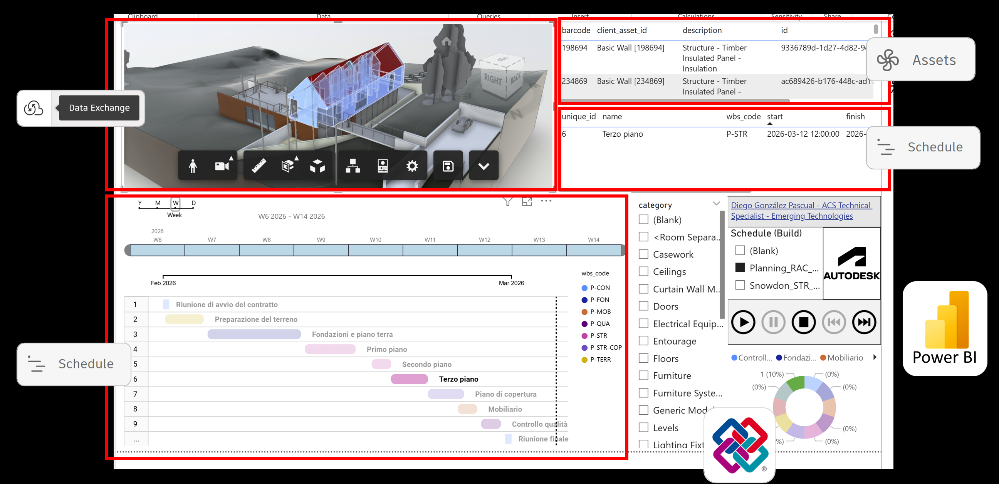
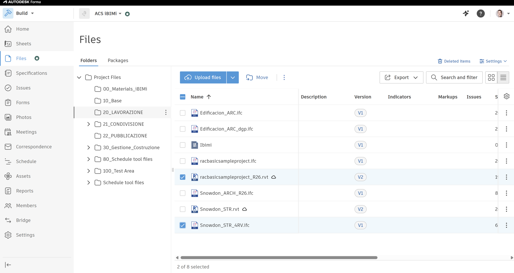
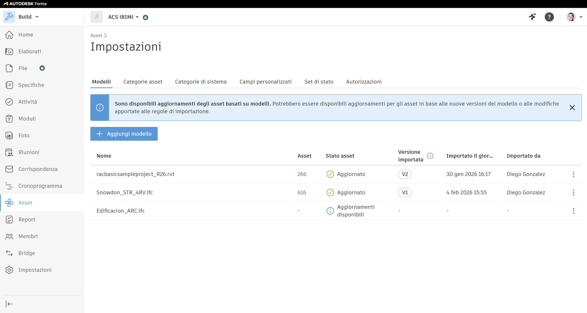
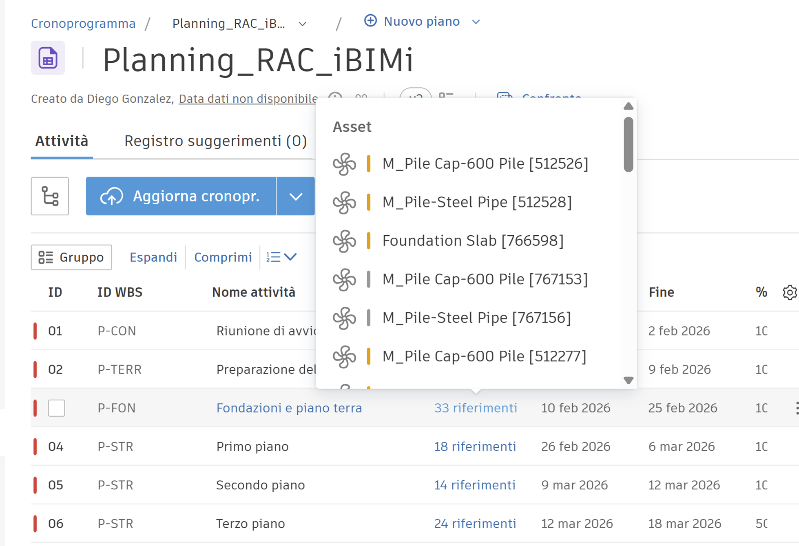
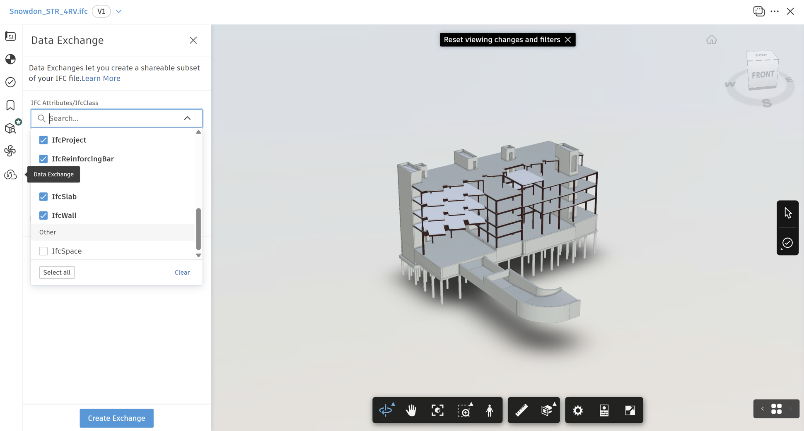
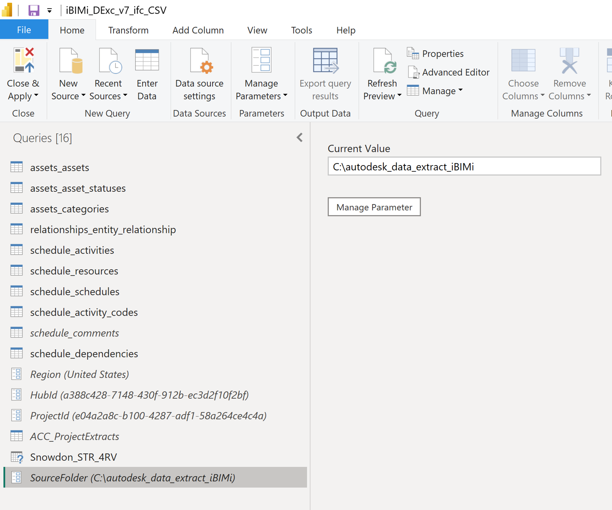
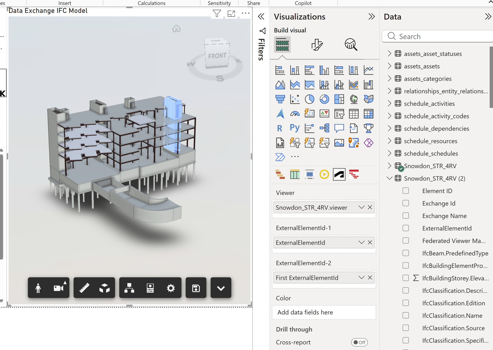
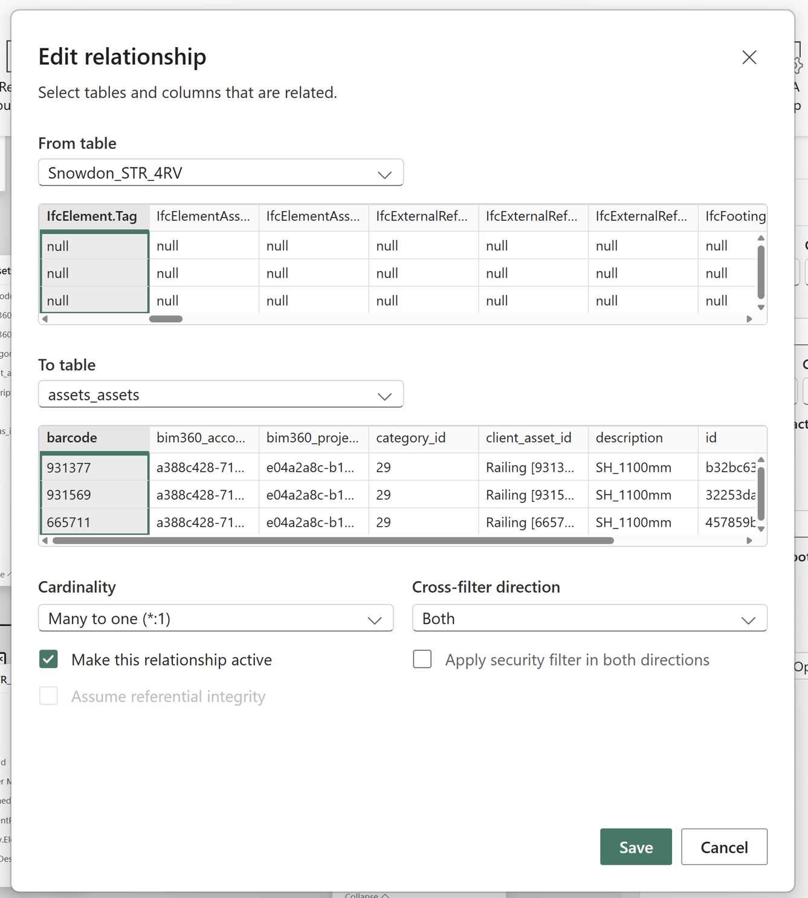
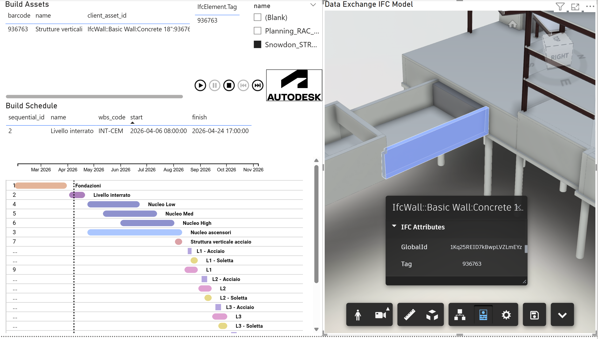

# Autodesk Forma Build → Power BI 4D Dashboard Template

**Author:** Diego González Pascual
**Scope:** Autodesk Forma Build + Data Exchange + Power BI
**Use case:** 4D simulation + data-driven construction dashboards

---

## 🌍 Overview

### 🇬🇧 English

This repository provides a complete workflow to connect **Autodesk Forma Build** with **Power BI**, enabling:

* 4D construction simulation (3D + time)
* Data-driven dashboards
* Integration between:

  * BIM Models (**RVT or IFC**)
  * Build Assets
  * Build Schedule
  * Data Exchange
  * Data Connector extraction

The goal is to provide **ready-to-use Power BI templates (.pbix)** that users can easily adapt by simply updating data sources.

---

### 🇪🇸 Español

Este repositorio muestra un flujo completo para conectar **Autodesk Forma Build** con **Power BI**, permitiendo:

* Simulación 4D (modelo + tiempo)
* Dashboards avanzados
* Integración entre modelos BIM (**RVT o IFC**), Assets y Planning

---

### 🇮🇹 Italiano

Questo repository mostra un flusso completo per collegare **Autodesk Forma Build** con **Power BI**, permettendo:

* Simulazione 4D
* Dashboard avanzati
* Integrazione tra modelli BIM (**RVT o IFC**), asset e planning

---

## 🧠 Concept



This workflow connects:

* **3D Model (Data Exchange)**
* **Assets (Build)**
* **Schedule (Build)**

Into a unified Power BI dashboard.

---

## 🧩 What’s included

* Power BI Templates:

  * `/templates/PowerBI_IFC_Template.pbix`
  * `/templates/PowerBI_RVT_Template.pbix`
* Sample models (IFC + RVT)
* Sample schedules (XML)
* Documentation
* Screenshots

---

## 🔄 Workflow Overview

### 1. BIM Model in Forma



* Upload IFC or RVT model
* Use it as the base for Assets and Data Exchange

---

### 2. Create Assets from Model



* Generate assets from BIM elements
* Map **ElementID → Barcode**

---

### 3. Link Assets to Schedule



* Create planning (Schedule)
* Link assets to activities

---

### 4. Generate Data Extraction

* Use **Data Connector**
* Export:

  * Assets
  * Relationships
  * Schedule

---

### 5. Create Data Exchange



* Extract model data from Forma or ACC
* This will be used for 3D visualization in Power BI

---

### 6. Power BI Integration

#### Data Connector (CSV)



* Open Power BI
* Go to **Transform Data**
* Update `SourceFolder` parameter to your extracted CSV folder

---

#### Data Exchange (3D Model)



* Use **Autodesk Data Connector for Power BI**
* Paste your Data Exchange URL
* Load your model

---

#### Model Relationships



* Connect:

  * `Assets.barcode`
  * Model ID field:

    * IFC → `IfcElement.Tag`
    * RVT → `Original System Id`

---

### 7. Final Result: 4D Dashboard



* 3D model visualization
* Time-based simulation
* Gantt chart
* Asset filtering

---

## 🚀 Quick Start

1. Open one of the templates:

   **IFC workflow:**

   ```
   /templates/PowerBI_IFC_Template.pbix
   ```

   **RVT workflow:**

   ```
   /templates/PowerBI_RVT_Template.pbix
   ```

2. Update Data Connector source:

   * Go to **Transform Data**
   * Modify `SourceFolder`
   * Point to your extracted `.csv` folder

3. Connect Data Exchange:

   * Get Data → Autodesk Connector
   * Paste your Data Exchange URL

4. Update relationships in Model View:

   * IFC → use `IfcElement.Tag`
   * RVT → use `Original System Id`

5. Done ✅

---

## 🔑 Key Technical Insight

The workflow depends on correct **ID mapping**:

| Source          | Field              |
| --------------- | ------------------ |
| BIM Model (IFC) | IfcElement.Tag     |
| BIM Model (RVT) | Original System Id |
| Assets          | Barcode            |
| Power BI        | Relationship key   |

---

## ⚠️ Notes

* Templates are provided **as-is**
* Data quality is critical
* Ensure:

  * No null IDs
  * Correct data types
  * Clean relationships

---

## 📚 Documentation

* [Workflow explanation](docs/workflow.md)
* [Setup guide](docs/setup-guide.md)

---

## 🤝 Contributions

Feel free to fork and adapt this workflow.

---

## 📄 License

MIT
